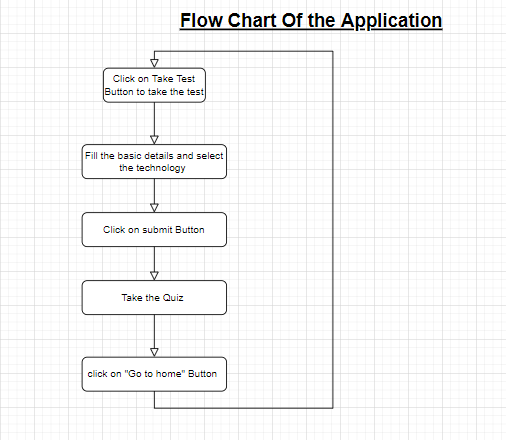

# Online-Test-Application
Online Test Application

Online-Test-Application is a software developed to conduct an Online quiz.
It is accessed by entering the username and e-mail id which is added to the database.
Before start of the Quiz, the rules and regulations are displayed that includes description of
number of questions to be answered and scoring methods.
Quiz is started by displaying ten questions with four options each based on category
chosen.

If the answer is correct, score is incremented by one and no marks will be awarded
for wrong answers.

Final score will be displayed and updated in the database with username.

# Screen-Snip

# Flow Chart

# Stacks-Used

## frontend = HTML , CSS , JAVASCRIPT
## BACKEND = NODE.JS , JAVASCRIPT
## DATABASE = MONGODB

# Steps to Set-Up
1)  npm insatll
2)  node index.js 

